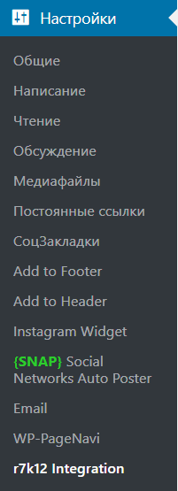
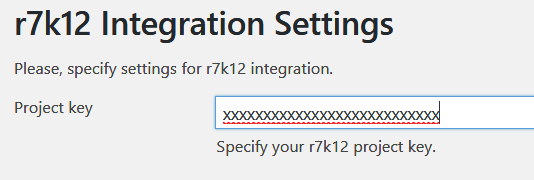
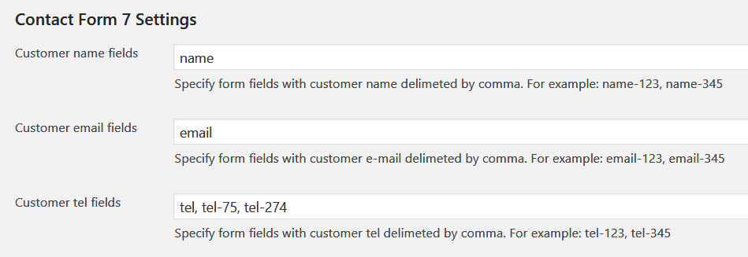
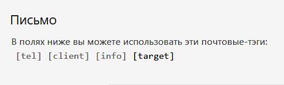

# r7k12
## Интеграция с r7k12
Версия 0.2
Плагин интеграции с системой r7k12.
Этот плагин передает в систему r7k12 информацию о просмотре страниц, данные форм ContactForm 7 и данные заказа WooCommerce.

## Установка плагина
1. Скачайте ZIP архив с [GITHub](https://github.com/ivannikitin-com/r7k12).
2. Штатно установите плагин в WordPress.
3. Активируйте плагин.

## Настройка плагина
После активации плагина перейдите в раздел WordPress Настройки --> Интеграция с r7k12   

### Настройка ключа проекта
Введите в поле ключ проекта и нажмите кнопку Сохранить изменения

### Настройка форм Contact Form 7
Для того, чтобы плагин мог считывать поля форм, ему необходимо указать название полей в формах CF7:   
1. Поля с именем пользователя
2. Поля с телефоном пользователя
3. Поля с E-mail пользователя

Укажите эти поля, при необходимости разделяйте поля запятой, и нажмите кнопку Сохранить изменения.

#### Как узнать поля форм
Откройте любую форму CF7, нажмите на закладку Письмо. Вы увидите список доступных полей в этой форме:   

### Настройка WooCommerce
Настройка WooCommerce не требуется. Плагин автоматически интегрируется с WooCommerce, когда тот активирован.
